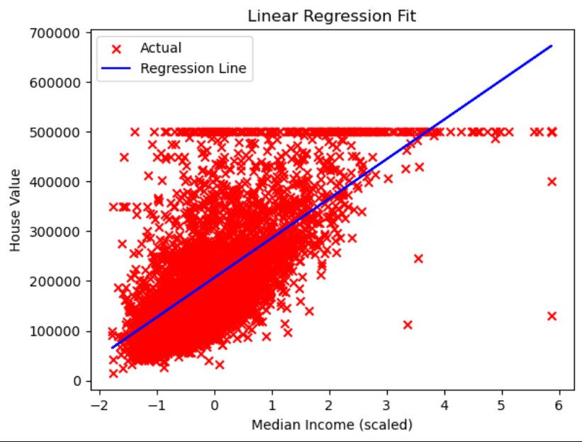

# california-house-price-linear-regression
This project implements Linear Regression from scratch without using Scikit-Learn for training. The goal is to understand the mathematical foundations of cost functions, gradient computation, and optimization using Gradient Descent.
# 🏠 California House Price Prediction using Linear Regression (From Scratch)

## 📌 Introduction

This project implements **Linear Regression from scratch** to predict California house prices based on median income. 

The main objective of this project is to deeply understand the mathematical foundations behind Linear Regression — including cost functions, gradient computation, and optimization using Gradient Descent — **without using Scikit-Learn for training**.

---

## 🎯 Project Overview

In this project:

- Linear Regression is implemented manually using NumPy.
- Model parameters (w, b) are optimized using Gradient Descent.
- The cost function (MSE) is tracked and visualized.
- Model performance is evaluated using standard regression metrics.
- A simple GUI is built using Tkinter to make real-time predictions.

The dataset used is the California Housing dataset.

---

## ⭐ Main Highlights

✅ Linear Regression implemented from scratch  
✅ No Scikit-Learn used for training  
✅ Manual Gradient Descent implementation  
✅ Cost vs Iteration visualization  
✅ Regression fit visualization  
✅ Evaluation Metrics (MSE, RMSE, R² Score)  
✅ GUI for real-time house price prediction  
✅ Clean and structured GitHub repository  

---

## 🧠 Mathematical Concepts Implemented

- Hypothesis Function:  
  h(x) = w*x + b  

- Cost Function (Mean Squared Error)

- Gradient Computation:
  - ∂J/∂w
  - ∂J/∂b

- Gradient Descent Update Rule:
  w = w - α * ∂J/∂w  
  b = b - α * ∂J/∂b  

---

## 📊 Evaluation Metrics

The model performance is evaluated using:

- **Mean Squared Error (MSE)**
- **Root Mean Squared Error (RMSE)**
- **R² Score**

These metrics help measure prediction accuracy and model performance.

---

## 📈 Training Visualization

### 🔹 Cost vs Iterations

### 🔹 Linear Regression Fit

---

## 🖥 GUI Interface

The project includes a Tkinter-based GUI that allows users to input median income and predict house prices in real-time.

---

## 🛠 Tech Stack

- Python
- NumPy
- Pandas
- Matplotlib
- Tkinter

---

## 📚 What I Learned

Through this project, I gained a strong understanding of:

- How Linear Regression works mathematically
- How Gradient Descent optimizes model parameters
- How cost functions guide model training
- How evaluation metrics measure performance
- The importance of data preprocessing
- How to structure a clean and professional GitHub repository
- Integrating machine learning logic with a GUI application

This project strengthened my foundation in Machine Learning fundamentals.

---

## 🎓 Future Improvements

- Extend to Multiple Linear Regression
- Implement Feature Scaling
- Add Regularization (L1/L2)
- Deploy as a Web App
- Add train-test split without Scikit-Learn

---

## 📬 Author

**Saatwik Sharma**

If you found this project interesting, feel free to ⭐ the repository!

